# Developer Guide

---

## Table of Contents

* [Design](#design)
  * [System Architecture](#system-architecture)
  * [UI Component](#ui-component)
  * [Logic Component](#logic-component)
  * [Model Component](#model-component)
  * [Storage Component](#storage-component)
* [Implementation](#implementation)
  * [Edit Student Feature](#edit-student-feature)
  * [Schedule Lesson Feature](#schedule-lesson-feature)
  * [Upcoming Lessons Feature](#upcoming-lessons-feature)
  * [Grade Feature](#grade-feature)
  * [Find Feature](#find-feature)
  * [Archive Student Feature](#archive-student-feature)
  * [Storage Feature](#storage-feature)
  * [Delete Feature](#delete-feature)
  * [Fee Management Feature](#fee-management-feature)
* [Appendix](#appendix)
  * [Product scope](#product-scope)
  * [User Stories](#user-stories)
  * [Non-Functional Requirements](#non-functional-requirements)
  * [Glossary](#glossary)
  * [Instructions for manual testing](#instructions-for-manual-testing)

---

## Design

### System Architecture

The **Architecture Diagram** given above explains the high-level design of the TutorSwift App.

Given below is a quick overview of the main components and how they interact with each other.

#### Main components of the architecture

- UI: The console interface of TutorSwift, implemented by the `Ui` class. It reads user input and displays results or error messages.
- Logic: The command executor. It consists of the `Parser` (which interprets user input) and the `Command` hierarchy (which executes actions on the model).
- Model: Holds the data of the App in memory. This includes `Student`, `StudentList`, `Lesson`, `FeeRecord`, and related domain classes.
- Storage: Reads data from, and writes data to, the hard disk. Implemented by the `Storage` class, which serializes and deserializes StudentList.
- Commons: Represents a collection of utility classes (e.g., exceptions, logging, validation) used by multiple other components.

**How the architecture components interact with each other**

The Sequence Diagram below shows how the components interact with each other for the scenario where the user issues the command `delete 1`.

---

### UI Component
The API of this component is specified in Ui.java.

#### Structure of the UI component
- Console-based single window: Ui is a single presentation class that centralises all input/output responsibilities `welcome, prompts, formatted results, error messages, dividers`.
- Presentation helpers: small private helpers `e.g., printStudentDetails` keep formatting consistent across different showXxx methods.
- Constants: visual strings `logo, dividers, messages` are kept as constants inside Ui so layout/text changes are localised.
- 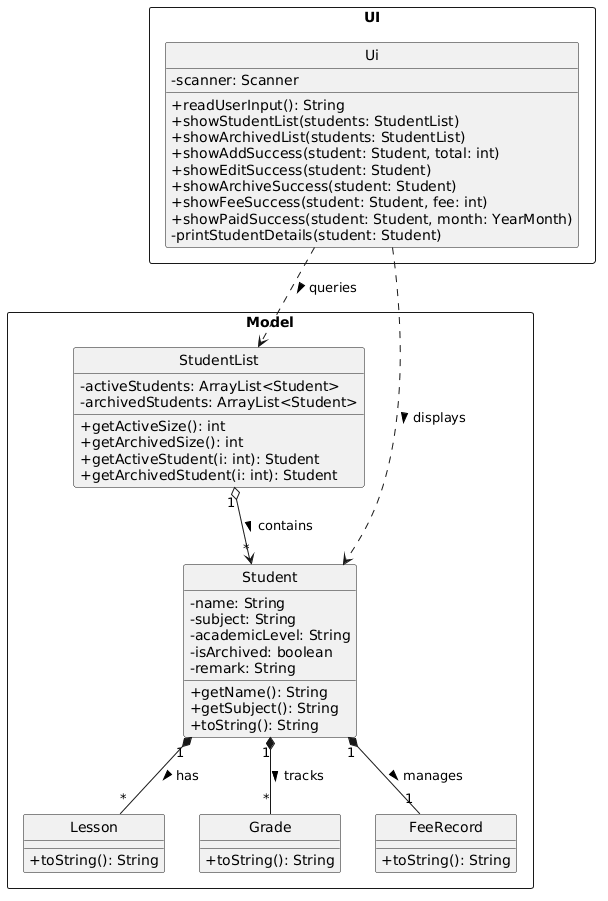
####  What the UI component does
- Reads raw input from System.in via readUserInput().
- Displays results for domain operations `add, edit, delete, archive, schedule, fee updates, find, upcoming lessons`.
- Shows errors passed up from the Logic layer `showError(String)`.
- Manages lifecycle of input resources`close()`, and prints startup/exit messages `showWelcome(), showExit()`.

---

### Logic Component
The API surface for parsing is specified in `Parser.parseUserInput(String)`. 
Command execution is specified by `command.Command` `execute(StudentList, Ui) and isExit()`

#### Structure of the Logic component
- Parser: single entry point `parseUserInput(String)` that tokenises the command word and delegates to `parseXxx` helpers (for example `parseAdd`, `parseEdit`, `parseDelete`).
- Command hierarchy: abstract Command defines `execute(StudentList, Ui)` and `isExit()`. Concrete subclasses (for example `AddCommand`, `DeleteCommand`) implement behaviour.
- Parsing helpers: `getValueByPrefix(...)` and `parseIndex(...)` encapsulate common parsing and validation logic.
  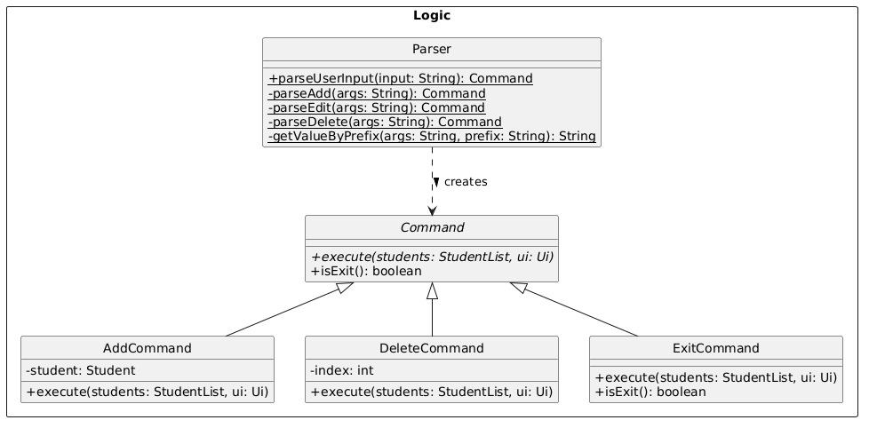
####  What the Logic component does
- Tokenise raw user input into `commandName` and `arguments`.
- Dispatch to the appropriate `parseXxx` helper based on `commandName`.
- Validate arguments and construct a concrete `Command` or throw `TutorSwiftException` with a user-facing message.
- Execute the returned command via `command.execute(students, ui)`, which performs model updates and calls `Ui` to display results.
- Persist: the caller (main loop) checks `isExit()` and, if not exiting, calls `Storage.save(students)`.

Sequence diagram for the sample execution of `delete` command

#### Design notes
- Parser is syntax/validation only;  `Command` objects encapsulate execution and interact with the Model.
- Adding a new command requires: add a `case` in `parseUserInput`, implement `parseXxx` helper, and implement `XxxCommand`.
- Parser throws `TutorSwiftException` with actionable messages; callers catch and forward messages to `Ui.showError(...)`.

---

### Model Component
The Model component holds the in‑memory data of TutorSwift and enforces domain rules. 
It defines the core entities (`Student`, `StudentList`, `Lesson`, `FeeRecord`, etc.) and provides APIs for mutation and queries.

#### What the Model component does
- Maintain the current state of all students (active and archived).
- Provide methods to add, delete, edit, archive, and query students.
- Track lessons, fee records, and remarks associated with each student.
- Enforce invariants such as preventing overlapping lessons or invalid fee states.

#### Key classes
- `Student`: encapsulates a single student’s details (name, subject, academic level, lessons, fee record, remark, archived flag).
- `StudentList`: manages collections of active and archived students, exposes APIs like `addStudent()`, `deleteActiveStudent()`.
- `Lesson`: represents a scheduled lesson with day and time slots.
- `Grade`: represents an academic achievement, consisting of an assessment name (e.g., "Midterm") and a numerical score
- `FeeRecord`: tracks monthly payment status for a student.
  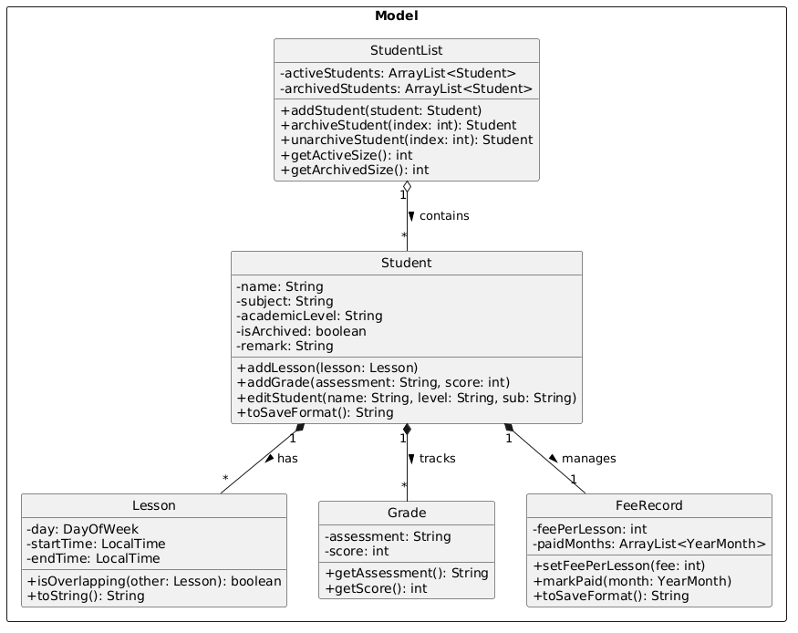
#### Interactions
- Logic commands call `StudentList` methods to mutate state.
- Storage serializes and deserializes `StudentList` and `Student` objects to/from disk.
- UI queries the Model indirectly (through Logic) to display lists or details.
  
---

### Storage Component
The API of this component is specified in `Storage.java`.

#### Structure of the Storage component
- Constructors: `Storage()` uses default path `./data/tutorswift.txt`. `Storage(String filePath)` supports tests.
- Public methods: `save(StudentList)` and `load()`.
- Helpers: `prepareDirectory(String)` and `parseLineToStudent(String)`.
- The class diagram below shows its internal structure and its dependencies on the `Model` classes:
  

#### What the Storage component does
- Ensure parent directories exist.
- Serialize active and archived students using `Student.toSaveFormat()` and write them to file.
- Read file line-by-line, reconstruct `Student` objects via `parseLineToStudent`, skip corrupted lines with warnings.
- Provide a testable constructor for temporary file paths

---

## Implementation

### Edit Student Feature

The edit mechanism allows the user to modify an existing student's details (name, academic level, and/or subject). 
It is facilitated primarily by the `EditCommand`, `StudentList`, and `Student` classes.

The edit feature's core logic resides within the `Student#editStudent(String name, String academicLevel, String subject)` method. 
The operation is executed through the following sequence:

1. `EditCommand#execute(students, ui)` is invoked
2. The command validates the provided `studentIndex`. 
If it is out of bounds (less than 1 or greater than the active list size), a TutorSwiftException is thrown.
3. The target student is retrieved using `StudentList#getActiveStudent(studentIndex - 1)` to account for 0-based list indexing.
4. It calls `Student#editStudent(...)`, passing in the new values and updates the student details accordingly.

Given below is an example usage scenario and how the edit mechanism behaves at each step.

Step 1.  The user launches the application. The StudentList contains an active student named "Alice" at index 1, who is taking "Math" and is "Primary 3".

Step 2. The user decides to switch the subject that "Alice" is taking to "Science", and executes the command `edit 1 sub/Science`.

Step 3. The parser interprets the user input and instantiates an `EditCommand` object with the `studentIndex` 1, and the new subject "Science" (with `newName` and `newLevel` left as null).

Step 4. The `EditCommand#execute()` method is called. It verifies that index 1 is within bounds and retrieves "Alice" from the StudentList using index 0.

Step 5. The command calls `studentToEdit.editStudent(null, null, "Science")`. The Student object skips the name and academic level updates. It detects that "Science" does not equal "Math". Consequently, it updates the subject to "Science".

Step 6. The `Ui` is called to display a success message showing Alice's updated profile.

The following sequence diagram shows how an edit operation executes through the objects:

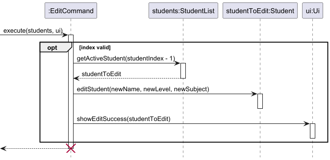

#### Design Considerations

**Aspect: How student details are accessed and updated.**

- **Alternative 1 (Current Choice)**: Pass the raw string arguments into `Student#editStudent()` and let the Student class handle the null checks and updates internally.

  - Pros: High cohesion and encapsulation. The EditCommand doesn't need to know the internal logic of how a student's attributes are stored or modified.

  - Cons: The editStudent method parameter list can become long if more fields (e.g., phone number, email) are added in the future.

- **Alternative 2**: Use setter methods directly inside EditCommand (e.g., if (newName != null) student.setName(newName);).

  - Pros: Keeps the Student class slightly smaller by removing the dedicated editStudent method.

  - Cons: Breaks encapsulation. It forces the command logic to be overly aware of the student's internal structure.

---

### Schedule Lesson Feature

The schedule mechanism allows the user to assign a new lesson timing to an existing student.
It is facilitated primarily by the `ScheduleCommand`, `StudentList`, `Student`, and `Lesson` classes.

The core logic resides within the `ScheduleCommand#execute()` method and `Student#addLesson(Lesson)`.
The operation is executed through the following sequence:

1. `ScheduleCommand#execute(students, ui)` is invoked.

2. The command retrieves the target student from the `StudentList` using the provided `studentName`.
If the student is not found, a `TutorSwiftException` is thrown.

3. A new `Lesson` object is instantiated using the provided `DayOfWeek`, `startTime`, and `endTime`.

4. It calls `Student#addLesson(newLesson)`. Inside this method, the new lesson is checked against the student's existing lessons. 
If an overlap is detected, a TutorSwiftException is thrown. Otherwise, it is appended to the student's internal list of lessons.

5. The `Ui#showLessonScheduled(String studentName, Lesson lesson)` is called to display a success message to the user.

Given below is an example usage scenario and how the schedule mechanism behaves at each step.

Step 1. The user launches the application. The `StudentList` contains an active student named "Alice".

Step 2. The user decides to schedule a 2-hour Math lesson for Alice on Monday morning, and executes the command `schedule Alice day/Monday start/10:00 end/12:00`.

Step 3. The parser interprets the user input and instantiates a `ScheduleCommand` object with `studentName` "Alice", `day` MONDAY, `startTime` 10:00, and `endTime` 12:00.

Step 4. The `ScheduleCommand#execute()` method is called. It queries the `StudentList` and successfully retrieves the `Student` object corresponding to "Alice".

Step 5. The command instantiates a new `Lesson` object with the given day and times.

Step 6. The command calls `targetStudent.addLesson(newLesson)`. The `Student` object iterates through its existing lessons and calls `isOverlapping(newLesson)`. 
Since Alice has no other lessons at this time, it safely appends the newly created lesson to her internal list.

Step 7. The command calls `ui.showLessonScheduled(targetStudent.getName(), newLesson)` to display a success message showing the scheduled lesson details.

The following sequence diagram shows how a schedule operation executes through the objects:

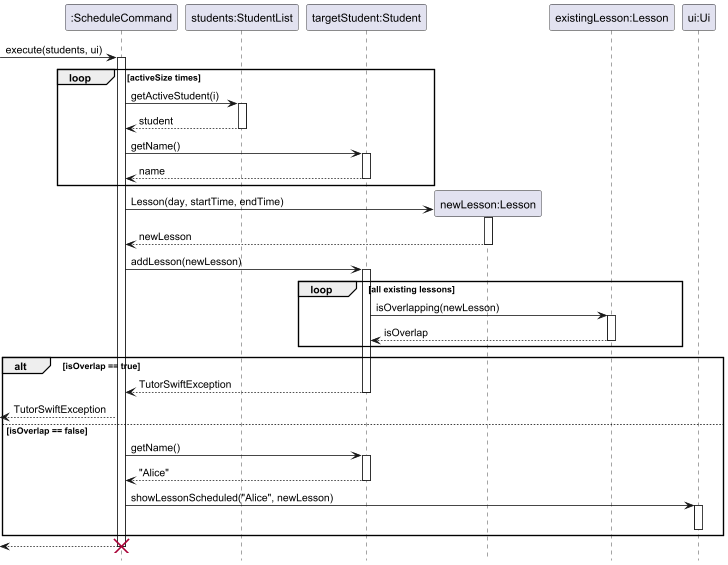

#### Design Considerations

**Aspect: Handling lesson time conflicts (Double-booking).**

- **Alternative 1 (Current Choice):**  Prevent overlapping lessons for the same student, but allow overlapping lessons across different students.
  
  - Pros: Prevents illogical scheduling (e.g., booking the same student for two different lessons at the exact same time). 
    However, it still provides flexibility for the tutor if they happen to teach multiple students in a shared group-tuition setting during the exact same time slot.
  - Cons: The tutor might accidentally double-book themselves for two different 1-on-1 private lessons at the same time and the system will not warn them.

- **Alternative 2**: Prevent all overlapping lessons by validating the new time slot against all existing lessons across the entire `StudentList`.

  - Pros: Strictly prevents accidental double-booking for the tutor.
  - Cons: Requires iterating through every student's timetable every time a new lesson is scheduled using `Lesson#isOverlapping()`. 
    Furthermore, group classes would be impossible to schedule unless a new "Group" class is introduced.

---

### Upcoming Lessons Feature
The upcoming mechanism provides the user with a dynamically sorted list of all scheduled lessons across all students, ordered by how soon they are happening relative to the current day and time.
It is facilitated primarily by the `UpcomingCommand`, `StudentList`, `Student`, `Lesson`, and the `RelativeLesson` wrapper class.

The core logic resides within the `UpcomingCommand#execute()` method and the `RelativeLesson` constructor.
The operation is executed through the following sequence:

1. `UpcomingCommand#execute(students, ui)` is invoked.

2. The command initialises an empty `ArrayList` to store all lessons and retrieves the current `DayOfWeek` and `LocalTime`.

3. It iterates through every active student in the `StudentList` using `getActiveSize()` and `getActiveStudent(i)`.

4. For each student, it retrieves their lessons via `getLessons()`. For every lesson, a new `RelativeLesson` object is instantiated. This wrapper class bundles the student, the lesson, and the current time to calculate `daysFromToday`.

5. The command adds all `RelativeLesson` objects into the list.

6. If the `allLessons` list is empty, it calls `Ui#showEmptyUpcomingLessons()`.

7. If the list is populated, it sorts the list using a custom comparator: first by `daysFromToday` (ascending), and then by the lesson's `startTime` (ascending).

8. The `Ui#showUpcomingLessons(allLessons)` method is called to display the sorted list to the user.

Given below is an example usage scenario and how the upcoming mechanism behaves at each step.

Step 1. The user launches the application. The `StudentList` contains active students with various scheduled lessons.

Step 2. The user executes the command `upcoming`.

Step 3. The parser interprets the user input and instantiates an `UpcomingCommand` object.

Step 4. The `UpcomingCommand#execute()` method is called. It fetches the current time (e.g., Monday, 10:00 AM).

Step 5. The command iterates through the `StudentList`. For every lesson found, it instantiates a `RelativeLesson`. The `RelativeLesson` calculates that a lesson on Tuesday is 1 day away, while a lesson on Monday at 9:00 AM (already passed) is 7 days away.

Step 6. All `RelativeLesson` objects are collected into an `ArrayList`. The command sorts this list chronologically.

Step 7. The command calls `ui.showUpcomingLessons(allLessons)` to display the sorted schedule to the tutor.

The following sequence diagram shows how the upcoming operation executes through the objects:

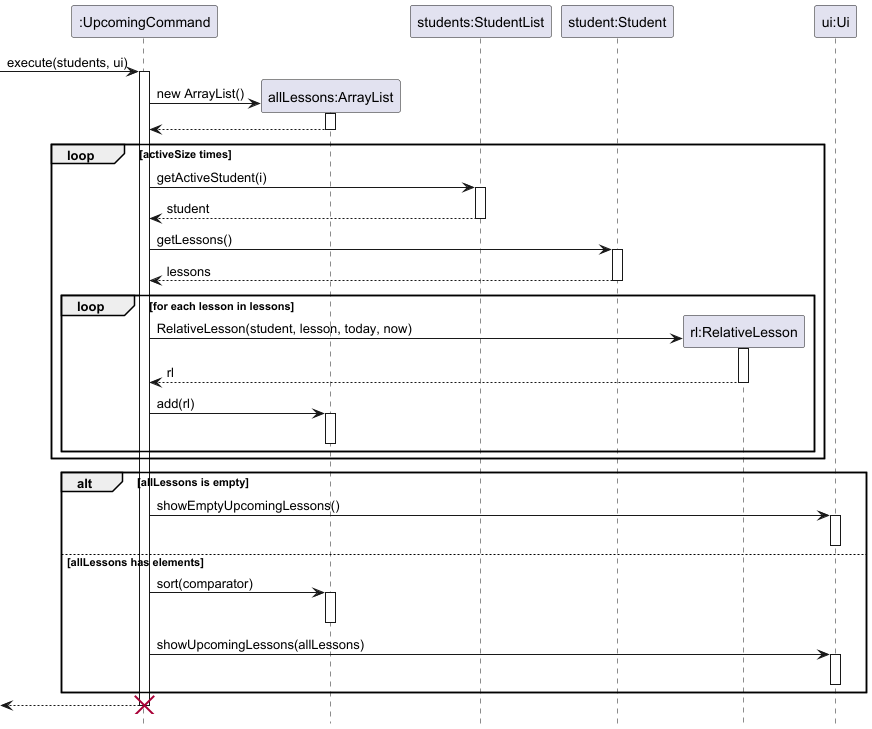

#### Design Considerations

**Aspect: Sorting recurring weekly lessons dynamically based on the current time.**

- **Alternative 1 (Current Choice)**: Use a `RelativeLesson` wrapper class to calculate the "distance" (in days) from the current time when the command is executed.

  - Pros: Clean separation of concerns. The core `Lesson` class remains a simple, lightweight entity that only knows its DayOfWeek and time. The time-distance math is isolated to the wrapper class when it is actually needed for viewing.

  - Cons: Instantiates multiple temporary RelativeLesson objects every time the command is executed

- **Alternative 2**: Store absolute dates (LocalDateTime) in the `Lesson` object instead of recurring days (`DayOfWeek`), and sort directly by the date.

  - Pros: Sorting becomes trivial, as standard Java Date objects can be compared directly.

  - Cons: Requires building a complex background mechanism to automatically "roll over" or update the lesson dates every week once they have passed.

---

### Grade Feature

#### Implementation

The `grade` command allows users to assign assessment scores to a student.  
It is facilitated by the `Parser`, `GradeCommand`, `StudentList`, and `Student` classes.

The command parsing is handled by `Parser#parseGrade()`, which extracts:
- the student index
- the assessment name (`m/`)
- the score (`g/`)

A `GradeCommand` object is then created with these parameters.

During execution, `GradeCommand#execute()` retrieves the target `Student` from `StudentList` and calls `Student#addGrade()`, which creates and stores a new `Grade` object.

---

#### Example Usage Scenario

Step 1. The user launches the application. The `StudentList` contains a student named "Alice" at index 1.

Step 2. The user executes the command:

`grade 1 m/WA1 g/85`

Step 3. The parser processes the input and creates a `GradeCommand` with:
- `index = 1`
- `assessment = "WA1"`
- `score = 85`

Step 4. `GradeCommand#execute()` is called. It validates that index 1 is within bounds.

Step 5. The command retrieves the student using `StudentList#getActiveStudent(0)`.

Step 6. The command calls:

`student.addGrade("WA1", 85)`

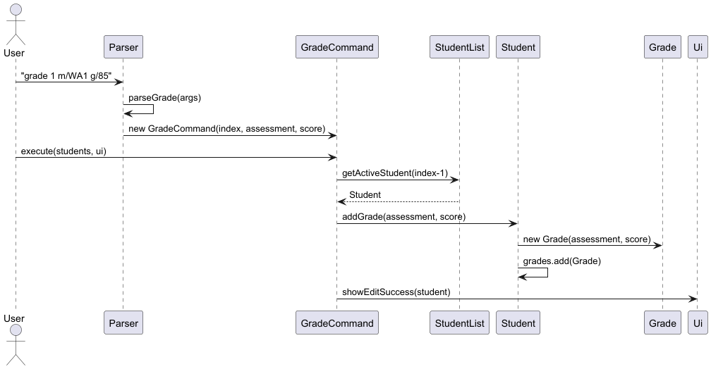

#### Design Considerations

**Aspect: Where to store grade logic**

- **Option 1 (chosen): Store in `Student`**
  - Keeps grade-related behavior encapsulated within the student
  - Aligns with object-oriented design (student owns its grades)

- **Option 2: Handle in `StudentList`**
  - Centralizes logic but reduces cohesion

Option 1 was chosen for better modularity and maintainability.

---

#### Notes

- Grades are stored as a list of `Grade` objects
- Duplicate assessments are allowed (no validation enforced)
---

### Find Feature

The find mechanism allows users to search for students across both active and archived lists using specific criteria. It is facilitated primarily by the `FindCommand`, `StudentList`, and `Student` classes.

#### Implementation

The find feature's core logic resides within the `FindCommand#execute(students, ui)` method and a helper `FindCommand#searchList(List<Student> list)` method. The operation is executed through the following sequence:

1. `FindCommand#execute(students, ui)` is invoked.
2. The command retrieves both the active and archived student collections from the `StudentList`.
3. The command iterates through both collections, applying a filter based on the non-null criteria (Name, Subject, and/or Level) provided during parsing.
4. For each field, the command performs a case-insensitive partial match using `String#contains()`.
5. The matching results are aggregated and passed to `Ui#showFindResults(results)` for display.

Given below is an example usage scenario and how the find mechanism behaves at each step.

Step 1. The user wants to find all students taking "Math" and executes `find sub/Math`.

Step 2. The `Parser` interprets the input and instantiates a `FindCommand` with `subject` set to "Math" and other fields set to `null`.

Step 3. The `FindCommand#execute()` method is called. It fetches all students from the `StudentList`.

Step 4. The command filters the students. If a student's subject is "Mathematics", it results in a match because "Mathematics" contains "math" (case-insensitive).

Step 5. The list of matching students is passed to the `Ui`.

Step 6. The `Ui` displays the matching students or an error message if no matches were found.

The following sequence diagram shows how a find operation executes through the objects:

#### Design Considerations

**Aspect: Search Scope (Active vs. Archive).**

* **Alternative 1 (Current Choice)**: Search both active and archived lists simultaneously.
  * **Pros**: User-friendly; users don't need to remember if a student was archived to find them.
  * **Cons**: Results may become cluttered if the archive is very large.

* **Alternative 2**: Only search the active list by default, requiring a specific flag (e.g., `find n/Alice /archive`) to search the archive.
  * **Pros**: More focused results and slightly faster execution for large datasets.
  * **Cons**: Adds complexity to the command syntax and might lead to "missing" students if the user forgets to check the archive.

---

#### Key classes
* **`Student`**: encapsulates a single student’s details (name, subject, academic level, lessons, fee record, **grades**, remark, archived flag).
* **`StudentList`**: manages collections of active and archived students, exposes APIs like `+ getActiveStudents()`, `+ getArchivedStudents()`.
* **`Grade`**: represents an academic achievement, consisting of an assessment name (e.g., "Midterm") and a numerical score.
* **`Lesson`**: represents a scheduled lesson with day and time slots.
* **`FeeRecord`**: tracks monthly payment status for a student.

---
### List Students Feature

The list mechanism allows the user to view all currently active students. It is facilitated primarily by the `ListCommand`, `StudentList`, and `Ui` classes.

The list feature's core logic resides within the `StudentList#getActiveSize()` and the `Ui#showStudentList(ArrayList<Student> students)` methods. The operation is executed through the following sequence:

1. `ListCommand#execute(students, ui)` is invoked.
2. The command calls `StudentList#getActiveSize()` to determine if there are students to display.
3. If the size is 0, the command calls `Ui#showError(message)` to inform the user the list is empty.
4. If students exist, it calls `StudentList#getActiveStudents()` to retrieve the collection.
5. The command then calls `Ui#showStudentList(...)`, passing the list to be rendered to the user.

Given below is an example usage scenario and how the list mechanism behaves at each step.

Step 1. The user launches the application. The `StudentList` contains two active students: "Alice" and "Bob".

Step 2. The user executes the command `list`.

Step 3. The `Parser` interprets the user input and instantiates a `ListCommand` object.

Step 4. The `ListCommand#execute()` method is called. It verifies that the active list is not empty by checking `StudentList#getActiveSize()`.

Step 5. The command retrieves the `ArrayList` of active students and passes it to `ui.showStudentList(activeStudents)`.

Step 6. The `Ui` iterates through the list, printing a formatted, numbered list of all active students and their profile details.

The following sequence diagram shows how a list operation executes through the objects:

#### Design Considerations

**Aspect: How the student list is passed to the UI.**

* **Alternative 1 (Current Choice)**: Pass the entire `ArrayList<Student>` directly to `Ui#showStudentList()`.
  * **Pros**: High performance; the list is passed by reference, and the `Ui` can handle formatting in a single pass.
  * **Cons**: The `Ui` becomes dependent on the `Student` object structure to extract names and details.

* **Alternative 2**: The `ListCommand` converts the students into a single large String and passes only that String to the `Ui`.
  * **Pros**: Better decoupling. The `Ui` remains a "dumb" component that only knows how to print strings, not how a `Student` is structured.
  * **Cons**: The `ListCommand` logic becomes cluttered with UI-related formatting code (like numbering and spacing), violating the Single Responsibility Principle.

---

#### Key classes
* **`Student`**: encapsulates a single student’s details (name, subject, academic level, lessons, fee record, **grades**, remark, archived flag).
* **`StudentList`**: manages collections of active and archived students, exposes APIs like `+ addStudent()`, `+ deleteActiveStudent()`.
* **`Grade`**: represents an academic achievement, consisting of an assessment name (e.g., "Midterm") and a numerical score.
* **`Lesson`**: represents a scheduled lesson with day and time slots.
* **`FeeRecord`**: tracks monthly payment status for a student.

#### Notes
- Implementation for showing Archived student list is similar and hence ommitted.
### Archive Student Feature

#### Implementation
The archive mechanism allows the user to move students between an active workspace and a historical record list. It is facilitated primarily by the `ArchiveCommand`, `UnarchiveCommand`, `ListArchiveCommand`, and `StudentList` classes.

The core logic resides within the `StudentList` class, which manages two separate internal lists: `activeStudents` and `archivedStudents`. This ensures that archived students do not clutter the primary view while their historical data remains accessible.

The archival operation is executed through the following sequence:
1. `ArchiveCommand#execute(students, ui)` is invoked with a specific index.
2. The command validates the provided `studentIndex` against the size of the active student list.
3. If valid, `StudentList#archiveStudent(index)` is called.
4. The student is removed from `activeStudents`, their `isArchived` status is set to `true`, and they are added to `archivedStudents`.
5. The `Ui` displays a success message showing the student's name and their new `[ARCHIVED]` status.

The following sequence diagram shows how an archive operation executes:

#### Design Considerations

**Aspect: Data structure for managing two states (Active vs. Archived).**

- **Alternative 1 (Current Choice):** Use two separate `ArrayList` objects within `StudentList`.
  - **Pros:** High performance for listing operations. Commands like `list` and `list-archive` only need to iterate over their respective small lists rather than filtering a giant database.
  - **Cons:** Requires explicit logic to move objects between lists, increasing the complexity of `StudentList`.

- **Alternative 2:** Use a single list and filter by a boolean flag `isArchived` during every display command.
  - **Pros:** Simpler data model; adding or deleting a student only affects one list.
  - **Cons:** Slower UI response time as the dataset grows, because every display command requires an $O(N)$ traversal to filter students.

---

### Storage Feature

#### Implementation
The storage mechanism ensures data persistence by saving and loading student data to a local text file (`./data/tutorswift.txt`). It is integrated into the `TutorSwift` main loop to provide automatic saving after every successful command execution.

The persistence logic is handled by the `Storage` class, which manages the following sub-tasks:

1.  **Automatic Saving**: After a command is successfully executed in `TutorSwift#run()`, `storage.save(students)` is triggered. The system iterates through both active and archived lists.
2.  **Data Encoding**: Each `Student` object is converted into a structured, pipe-separated string via `Student#toSaveFormat()`. The format is: `Name | Level | Subject | isArchived | Grades | Remark | FeeRecord`.
3.  **Data Decoding**: Upon startup, `Storage#load()` reads the file. The method `parseLineToStudent` carefully reconstructs the `Student` object, including nested data like grade lists and financial records.
4.  **Robust Error Handling**: If a specific line is corrupted (e.g., manually edited incorrectly by a user), the system catches the exception, logs a `WARNING`, and skips to the next line. This prevents a single error from making the entire database unreadable.

The following sequence diagram illustrates how the application state is automatically persisted after a user command is executed:

#### Design Considerations

**Aspect: Execution of the Save operation.**

- **Alternative 1 (Current Choice):** Save to disk after every successful command.
  - **Pros:** Maximum data safety. In the event of an unexpected crash or power loss, the user loses at most one command's worth of work.
  - **Cons:** Slight performance overhead due to frequent Disk I/O (though negligible for text files of this size).

- **Alternative 2:** Save only when the user executes the `exit` command.
  - **Pros:** Better performance as Disk I/O happens only once.
  - **Cons:** High risk of data loss if the user closes the terminal window directly or the system crashes.

---

### Delete Feature

The `delete` command permanently removes an active student from the student list by
their displayed index. It is handled by the `Parser`, `DeleteCommand`,
`StudentList` and `Ui` classes.

Command parsing is handled by `Parser#parseDelete()`, which extracts the student
index from the raw argument string. It validates that the index is a non-empty,
positive integer before constructing a `DeleteCommand` object.

During execution, `DeleteCommand#execute()` performs a range check against the
active list size, retrieves the target `Student` before removal, so its details
remain available for the success message, then calls
`StudentList#deleteActiveStudent()` to remove it permanently.

#### Example Usage Scenario

Step 1. The user launches the application. The `StudentList` contains two active
students: "Alice" at index 1 and "Bob" at index 2.

Step 2. The user decides to remove Alice and executes the command `delete 1`.

Step 3. The parser processes the input, validates that `"1"` is a positive integer
and creates a `DeleteCommand` with `index = 1`.

Step 4. `DeleteCommand#execute()` is called. It converts the one-based index to
zero-based (`index - 1 = 0`) and verifies it is within the active list bounds.

Step 5. The command retrieves Alice using `StudentList#getActiveStudent(0)` before
deletion, preserving her details for the success message.

Step 6. The command calls `StudentList#deleteActiveStudent(0)`, permanently removing
Alice from the active list.

Step 7. `Ui#showDeleteSuccess(deletedStudent, students.getActiveSize())` is called,
displaying Alice's details and the updated active student count of 1.

Step 8. Control returns to `TutorSwift`, which automatically calls
`Storage#save(students)` to persist the updated list to disk.

The following sequence diagram shows how a delete operation executes through the
objects:

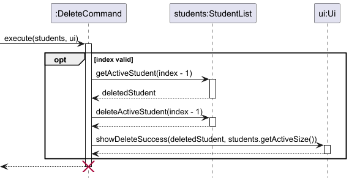

#### Design Considerations

**Aspect: When to retrieve the student object relative to deletion**

- **Alternative 1 (Chosen):** Call `StudentList#getActiveStudent()` to
  capture the student reference before calling `deleteActiveStudent()`.
  - Pros: The deleted student's details remain accessible for the success message,
    without needing to store a separate copy elsewhere.
  - Cons: Requires two separate calls to `StudentList` instead of one combined
    remove-and-return operation.

- **Alternative 2:** Have `StudentList#deleteActiveStudent()` return the removed
  `Student` object directly (similar to `ArrayList#remove()`).
  - Pros: Reduces the number of method calls.
  - Cons: Requires changing the existing `StudentList` and updating all
    callers, which increases the risk of introducing bugs across the codebase.

---

### Fee Management Feature

The fee management feature allows the user to track lesson fees and monthly payment
status for each student. It comprises three commands `fee`, `paid` and `unpaid`. They
are handled by `FeeCommand`, `PaidCommand` and `UnpaidCommand` respectively, with fee
data encapsulated in the `FeeRecord` class inside each `Student`.

The primary logic is implemented in `FeeCommand#execute()`, `PaidCommand#execute()`
and `UnpaidCommand#execute()`, each of which delegates state changes to `FeeRecord` 
through `Student`.

Each `Student` owns a `FeeRecord` instance that stores
two things: a per-lesson fee (`int feePerLesson`) and a list of months the student
has paid (`ArrayList<YearMonth> paidMonths`). The `fee` command sets the per-lesson
rate, `paid` command adds a given `YearMonth` from the paid list while `unpaid` command
removes it. All three commands share a common execution flow: validate the index, 
retrieve the student, update the `FeeRecord` and call `Ui` to display the result.

#### Example Usage Scenario

Step 1. The user launches the application. `StudentList` contains "Alice" at index 1,
with `feePerLesson = 0` and no paid months recorded.

Step 2. The user sets Alice's lesson fee by executing `fee 1 f/80`.

Step 3. The parser extracts index `1` and fee `80` from the argument string and
constructs a `FeeCommand(1, 80)`.

Step 4. `FeeCommand#execute()` validates that index 1 is within bounds, retrieves
Alice via `StudentList#getActiveStudent(0)`, calls `Student#setFeePerLesson(80)`
(which delegates to `FeeRecord#setFeePerLesson(80)`) and calls
`Ui#showFeeSuccess(alice, 80)`.

Step 5. The user marks Alice as paid for March 2026 by executing `paid 1 ym/2026-03`.

Step 6. The parser constructs a `PaidCommand(1, YearMonth.of(2026, 3))`.

Step 7. `PaidCommand#execute()` retrieves Alice, calls `Student#markPaid(2026-03)`
(which calls `FeeRecord#markPaid(2026-03)`), adding the month to `paidMonths` if not
already present. `Ui#showPaidSuccess(alice, 2026-03)` is then called.

Step 8. The user realises the payment amount received was incorrect and executes
`unpaid 1 ym/2026-03`.

Step 9. `UnpaidCommand#execute()` retrieves Alice and calls
`Student#markUnpaid(2026-03)`, which calls `FeeRecord#markUnpaid(2026-03)` to remove
March 2026 from `paidMonths`. Then, `Ui#showUnpaidSuccess(alice, 2026-03)` is called.

Step 10. After each command, control returns to `TutorSwift`, which calls
`Storage#save(students)` to persist the updated data to disk.

The following sequence diagram shows how a `fee` command executes through the objects:

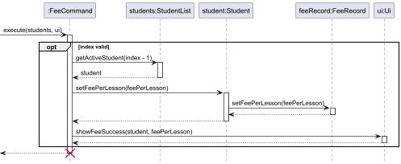

The following sequence diagram shows how a `paid` command executes through the objects:

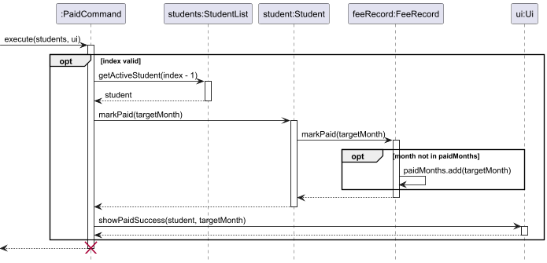

The following sequence diagram shows how an `unpaid` command executes through the objects:

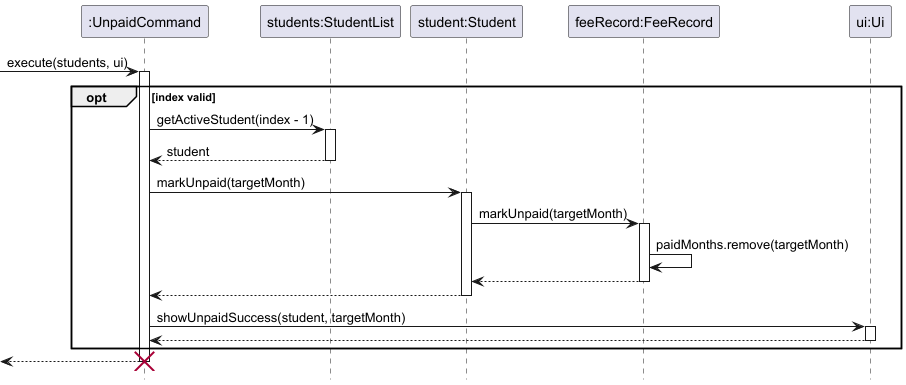

#### Design Considerations

**Aspect: Where to store and manage fee and payment data.**

- **Alternative 1 (Chosen)**: Encapsulate fee and payment data in a separate
  `FeeRecord` class owned by each `Student`.

  - Pros: High cohesion as all fee-related logic (marking paid/unpaid)
    lives in one place, making the code cleaner. Extending the record is also 
    easier as it only requires changes to `FeeRecord`.

  - Cons: Adds an extra class and layer, so command classes must call through
    `Student` to reach `FeeRecord`.

- **Alternative 2**: Store fee data directly in the `Student` class.

  - Pros: Simpler structure with fewer classes.

  - Cons: Clutters the `Student` class and mixes payment concerns with student identity
    and academic data, reducing cohesion and making maintenance harder.

---

## Appendix

## Product scope

--- 

### Target user profile

TutorSwift is for private tutors who manage multiple students and need to record lesson data and administrative details instantly between sessions.

### Value proposition

TutorSwift is a high-speed administrative tool that allows tutors to track students, grades, lessons and manage tuition fees through CLI interaction, it helps tutors stay organised without sacrificing their break time or lesson quality.

## User Stories

---

| Version | As a ...                        | I want to ...                                                                                               | So that I can ...                                                                                                                           |
|---------|---------------------------------|-------------------------------------------------------------------------------------------------------------|---------------------------------------------------------------------------------------------------------------------------------------------|
| v1.0    | tutor                           | add a student with their name, academic level, and subject                                                  | track my new student enrolments                                                                                                             |
| v1.0    | tutor                           | view a list of all my existing students and his/her details                                                 | monitor student record                                                                                                                      |
| v1.0    | tutor                           | delete a student who no longer take tuition classes with me                                                 | update and maintain currency of my student list                                                                                             |
| v1.0    | tutor                           | edit my student details so that I can handle changes in student information                                 | edit my student records to stay up to date without deleting entire student record                                                           |
| v2.0    | tutor                           | schedule a lesson for a specific student by assigning them a day of the week, a start time, and an end time | accurately track my teaching timetable and ensure I do not accidentally double-book myself for that time slot.                              |
| v2.0    | tutor                           | view a sorted list of all my scheduled lessons relative to the current day and time                         | instantly see who I am teaching next and prepare my materials without having to manually search through every student's individual profile. |
| v2.0    | tutor                           | assign grades to my students                                                                                | track their assessment performance and keep their academic records up to date.                                                              |
| v2.0    | tutor                           | add remarks to my students                                                                                  | provide personalized notes or feedback and keep track of important student observations.                                                    |
| v2.0    | tutor                           | record the student's tuition fee for each lesson                                                            | keep track of how much each student owes per lesson.                                                                                        |
| v2.0    | tutor                           | mark whether the payment has been paid or unpaid for a particular month                                     | keep track of payment status and outstanding payments efficiently.                                                                          |
| v2.0    | tutor                           | find a student, subject or level by keyword quickly                                                         | search for details                                                                                                                          |
| v2.0    | tutor managing multiple cohorts | move graduated or inactive students to a separate archive list                                              | still access their performance history if needed and my primary workspace remains uncluttered                                               |
| v2.0    | tutor                           | save my data automatically to the local disk                                                                | do not have to manually save my progress and can resume exactly where I left off when I restart the app.                                    |

## Non-Functional Requirements

---

1. Hardware Requirements: The system should work on any mainstream operating system (Windows, macOS, Linux) that has Java 17 or above installed.
2. Performance: The system should respond to all user commands within two seconds.
3. Capacity: The system should be capable of holding up to 1,000 student profiles (including their associated grades and lessons, etc) without noticeable sluggishness in performance for typical usage.
4. User Interface: A user who is an above-average typist should be able to accomplish tasks significantly faster using the Command Line Interface (CLI) compared to a traditional mouse-driven Graphical User Interface (GUI).
5. Data Persistence: Data should be saved locally in a human-editable text file without requiring the installation of a dedicated Database Management System (DBMS).
6. Robustness: The system should not crash under typical usage or when provided with invalid user input, it should gracefully handle errors and display helpful feedback to the user.

## Glossary

---

* *CLI (Command Line Interface)* - A text-based user interface used to view and manage application files and execute programs by typing commands
* *Active Student* - A student currently enrolled in the tutor's classes, visible in the main student list
* *Archived Student* - A past student whose records (grades, past subjects) are retained in the system for historical reference, but who is hidden from the active main list
* *Prefix* - A specific character or word sequence (e.g., sub/, day/, n/) used in a command to denote the type of data being supplied by the user.

## Instructions for manual testing

---

Given below are instructions to test the app manually.

* Note: These instructions only provide a starting point for testers to verify the basic functionality of the application. Testers are expected to do more exploratory testing.

### Launch and Shutdown

1. Initial launch 
- Download the latest `.jar` file from the releases page.
- Move the `.jar` file into an empty folder where you want to store your TutorSwift data.
- Open your terminal or command prompt, navigate to the folder, and run the command `java -jar tutorswift.jar`.
- _Expected outcome:_ The application launches, displays the TutorSwift logo, the welcome message, and creates a `data` folder (if it does not already exist).

2. Shutdown
- Type `bye` and press Enter to exit the application.
- _Expected outcome:_ The application displays a goodbye message and terminates cleanly. All data used during the session is saved to the data storage file.

### Adding and Managing Students

1. Adding a student:

- Test case: `add n/John Doe l/Secondary 3 sub/Math`

  Expected outcome: A new student named John Doe is added. The UI displays a success message showing the student's details and the updated total student count.

- Test case: `add n/Jane l/Primary 4 (Missing subject prefix)`

  Expected outcome: The system throws an error stating that the format is invalid and displays the correct command format.

2. Editing a student:

- Prerequisite: Ensure there is a student at index 1.

- Test case: `edit 1 sub/Science`

  Expected outcome: The student at index 1 has their subject updated to "Science".

### Deleting an active student

- Prerequisites: At least one student in the active list. Use `list` to verify index of current active students.
- Test case: `delete 1`  
  Expected outcome: First active student is removed. Success message shows deleted student's details and updated total student count.
- Test case: `delete 0`  
  Expected outcome: No student is removed. Error details shown in the status message.
- Other incorrect delete commands to try: `delete`, `delete -5`, `delete abc`  
  Expected outcome: Similar to previous.

### Setting a student's per-lesson fee

- Prerequisites: At least one active student in the list. Use `list` to verify.
- Test case: `fee 1 f/80`  
  Expected outcome: Fee for the first student is set to $80/lesson. Updated student details shown in the result message.
- Test case: `fee 1 f/0`  
  Expected outcome: Fee is not updated. Error message is shown.
- Other incorrect commands to try: `fee`, `fee 1`, `fee 0 f/50`, `fee 1 f/-50`  
  Expected outcome: Similar to previous.

### Marking a student's payment as paid

- Prerequisites: At least one active student in the list. Use `list` to verify.
- Test case: `paid 1 ym/2026-03`  
  Expected outcome: First student marked as PAID for March 2026. Updated details shown in result message.
- Test case: `paid 1 ym/2026-13`  
  Expected outcome: Error message is shown. Month value 13 is invalid.
- Other incorrect commands to try: `paid`, `paid 1`, `paid 0 ym/2026-03`  
  Expected outcome: Error message is shown.

### Marking a student's payment as unpaid

- Prerequisites: At least one active student previously marked as paid for a month. Use `paid 1 ym/2026-03` to set up.
- Test case: `unpaid 1 ym/2026-03`  
  Expected outcome: March 2026 removed from the student's paid months. Updated details shown in result message.
- Test case: `unpaid 1`  
  Expected outcome: Error message is shown. Missing `ym/` prefix.
- Other incorrect commands to try: `unpaid`, `unpaid 1 ym/2026-13`, `unpaid 0 ym/2026-03`  
  Expected outcome: Error message is shown.

### Scheduling and Upcoming Lessons

- Prerequisite: Ensure a student named "John Doe" exists.

- Test case: `schedule John Doe day/Monday start/14:00 end/16:00`

  Expected outcome: A 2-hour lesson is added to John Doe's profile. A success message is displayed.

- Test case: upcoming

  Expected outcome: The UI displays a sorted list of all scheduled lessons for the next 7 days.

### Data Storage

- Launch the app and add a few students and lessons.

- Type `bye` to close the app.

- Navigate to the data/tutorswift.txt file and open it in a text editor to verify the data is saved in the delimited format.

- Modify one of the student's names directly in the text file and save it.

- Relaunch the app and type `list`.

  Expected outcome: The app loads successfully and displays the modified data, proving local file storage works correctly.
