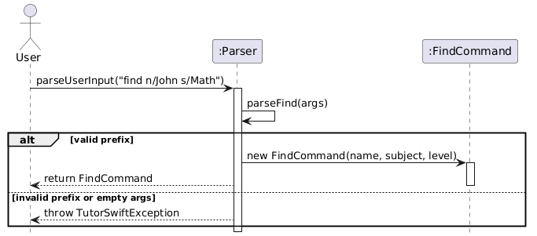

# Developer Guide

## Acknowledgements

{list here sources of all reused/adapted ideas, code, documentation, and third-party libraries -- include links to the original source as well}

## Design & Implementation

This section describes some noteworthy details on how certain features are implemented.

---

### Edit Student Feature

The edit mechanism allows the user to modify an existing student's details (name, academic level, and/or subject). 
It is facilitated primarily by the `EditCommand`, `StudentList`, and `Student` classes.

The edit feature's core logic resides within the `Student#editStudent(String name, String academicLevel, String subject)` method. 
The operation is executed through the following sequence:

1. `EditCommand#execute(students, ui)` is invoked
2. The command validates the provided `studentIndex`. 
If it is out of bounds (less than 1 or greater than the active list size), a TutorSwiftException is thrown.
3. The target student is retrieved using `StudentList#getActiveStudent(studentIndex - 1)` to account for 0-based list indexing.
4. It calls `Student#editStudent(...)`, passing in the new values and updates the student details accordingly.

Given below is an example usage scenario and how the edit mechanism behaves at each step.

Step 1.  The user launches the application. The StudentList contains an active student named "Alice" at index 1, who is taking "Math" and is "Primary 3".

Step 2. The user decides to switch the subject that "Alice" is taking to "Science", and executes the command `edit 1 sub/Science`.

Step 3. The parser interprets the user input and instantiates an `EditCommand` object with the `studentIndex` 1, and the new subject "Science" (with `newName` and `newLevel` left as null).

Step 4. The `EditCommand#execute()` method is called. It verifies that index 1 is within bounds and retrieves "Alice" from the StudentList using index 0.

Step 5. The command calls `studentToEdit.editStudent(null, null, "Science")`. The Student object skips the name and academic level updates. It detects that "Science" does not equal "Math". Consequently, it updates the subject to "Science".

Step 6. The `Ui` is called to display a success message showing Alice's updated profile.

The following sequence diagram shows how an edit operation executes through the objects:

#### Design Considerations

**Aspect: How student details are accessed and updated.**

- **Alternative 1 (Current Choice)**: Pass the raw string arguments into `Student#editStudent()` and let the Student class handle the null checks and updates internally.

  - Pros: High cohesion and encapsulation. The EditCommand doesn't need to know the internal logic of how a student's attributes are stored or modified.

  - Cons: The editStudent method parameter list can become long if more fields (e.g., phone number, email) are added in the future.

- **Alternative 2**: Use setter methods directly inside EditCommand** (e.g., if (newName != null) student.setName(newName);).

  - Pros: Keeps the Student class slightly smaller by removing the dedicated editStudent method.

  - Cons: Breaks encapsulation. It forces the command logic to be overly aware of the student's internal structure.

---

### Schedule Lesson Feature

The schedule mechanism allows the user to assign a new lesson timing to an existing student.
It is facilitated primarily by the `ScheduleCommand`, `StudentList`, `Student`, and `Lesson` classes.

The core logic resides within the `ScheduleCommand#execute()` method and `Student#addLesson(Lesson)`.
The operation is executed through the following sequence:

1. `ScheduleCommand#execute(students, ui)` is invoked.

2. The command retrieves the target student from the `StudentList` using the provided `studentName`.
If the student is not found, a `TutorSwiftException` is thrown.

3. A new `Lesson` object is instantiated using the provided `DayOfWeek`, `startTime`, and `endTime`.

4. It calls `Student#addLesson(newLesson)`. Inside this method, the new lesson is checked against the student's existing lessons. 
If an overlap is detected, a TutorSwiftException is thrown. Otherwise, it is appended to the student's internal list of lessons.

5. The `Ui#showLessonScheduled(String studentName, Lesson lesson)` is called to display a success message to the user.

Given below is an example usage scenario and how the schedule mechanism behaves at each step.

Step 1. The user launches the application. The `StudentList` contains an active student named "Alice".

Step 2. The user decides to schedule a 2-hour Math lesson for Alice on Monday morning, and executes the command `schedule Alice day/Monday start/10:00 end/12:00`.

Step 3. The parser interprets the user input and instantiates a `ScheduleCommand` object with `studentName` "Alice", `day` MONDAY, `startTime` 10:00, and `endTime` 12:00.

Step 4. The `ScheduleCommand#execute()` method is called. It queries the `StudentList` and successfully retrieves the `Student` object corresponding to "Alice".

Step 5. The command instantiates a new `Lesson` object with the given day and times.

Step 6. The command calls `targetStudent.addLesson(newLesson)`. The `Student` object iterates through its existing lessons and calls `isOverlapping(newLesson)`. 
Since Alice has no other lessons at this time, it safely appends the newly created lesson to her internal list.

Step 7. The command calls `ui.showLessonScheduled(targetStudent.getName(), newLesson)` to display a success message showing the scheduled lesson details.

The following sequence diagram shows how a schedule operation executes through the objects:

### Design Considerations

**Aspect: Handling lesson time conflicts (Double-booking).**

- **Alternative 1 (Current Choice):**  Prevent overlapping lessons for the same student, but allow overlapping lessons across different students.
  
  - Pros: Prevents illogical scheduling (e.g., booking the same student for two different lessons at the exact same time). 
    However, it still provides flexibility for the tutor if they happen to teach multiple students in a shared group-tuition setting during the exact same time slot.
  - Cons: The tutor might accidentally double-book themselves for two different 1-on-1 private lessons at the same time and the system will not warn them.

- **Alternative 2**: Prevent all overlapping lessons by validating the new time slot against all existing lessons across the entire `StudentList`.

  - Pros: Strictly prevents accidental double-booking for the tutor.
  - Cons: Requires iterating through every student's timetable every time a new lesson is scheduled using `Lesson#isOverlapping()`. 
    Furthermore, group classes would be impossible to schedule unless a new "Group" class is introduced.

---

### Upcoming Lessons Feature
The upcoming mechanism provides the user with a dynamically sorted list of all scheduled lessons across all students, ordered by how soon they are happening relative to the current day and time.
It is facilitated primarily by the `UpcomingCommand`, `StudentList`, `Student`, `Lesson`, and the `RelativeLesson` wrapper class.

The core logic resides within the `UpcomingCommand#execute()` method and the `RelativeLesson` constructor.
The operation is executed through the following sequence:

1. `UpcomingCommand#execute(students, ui)` is invoked.

2. The command initialises an empty `ArrayList` to store all lessons and retrieves the current `DayOfWeek` and `LocalTime`.

3. It iterates through every active student in the `StudentList` using `getActiveSize()` and `getActiveStudent(i)`.

4. For each student, it retrieves their lessons via `getLessons()`. For every lesson, a new `RelativeLesson` object is instantiated. This wrapper class bundles the student, the lesson, and the current time to calculate `daysFromToday`.

5. The command adds all `RelativeLesson` objects into the list.

6. If the `allLessons` list is empty, it calls `Ui#showEmptyUpcomingLessons()`.

7. If the list is populated, it sorts the list using a custom comparator: first by `daysFromToday` (ascending), and then by the lesson's `startTime` (ascending).

8. The `Ui#showUpcomingLessons(allLessons)` method is called to display the sorted list to the user.

Given below is an example usage scenario and how the upcoming mechanism behaves at each step.

Step 1. The user launches the application. The `StudentList` contains active students with various scheduled lessons.

Step 2. The user executes the command `upcoming`.

Step 3. The parser interprets the user input and instantiates an `UpcomingCommand` object.

Step 4. The `UpcomingCommand#execute()` method is called. It fetches the current time (e.g., Monday, 10:00 AM).

Step 5. The command iterates through the `StudentList`. For every lesson found, it instantiates a `RelativeLesson`. The `RelativeLesson` calculates that a lesson on Tuesday is 1 day away, while a lesson on Monday at 9:00 AM (already passed) is 7 days away.

Step 6. All `RelativeLesson` objects are collected into an `ArrayList`. The command sorts this list chronologically.

Step 7. The command calls `ui.showUpcomingLessons(allLessons)` to display the sorted schedule to the tutor.

The following sequence diagram shows how the upcoming operation executes through the objects:

### Design Considerations

**Aspect: Sorting recurring weekly lessons dynamically based on the current time.**

- **Alternative 1 (Current Choice)**: Use a `RelativeLesson` wrapper class to calculate the "distance" (in days) from the current time when the command is executed.

  - Pros: Clean separation of concerns. The core `Lesson` class remains a simple, lightweight entity that only knows its DayOfWeek and time. The time-distance math is isolated to the wrapper class when it is actually needed for viewing.

  - Cons: Instantiates multiple temporary RelativeLesson objects every time the command is executed

- **Alternative 2**: Store absolute dates (LocalDateTime) in the `Lesson` object instead of recurring days (`DayOfWeek`), and sort directly by the date.

  - Pros: Sorting becomes trivial, as standard Java Date objects can be compared directly.

  - Cons: Requires building a complex background mechanism to automatically "roll over" or update the lesson dates every week once they have passed.

---

### Grade Feature

#### Implementation

The `grade` command allows users to assign assessment scores to a student.  
It is facilitated by the `Parser`, `GradeCommand`, `StudentList`, and `Student` classes.

The command parsing is handled by `Parser#parseGrade()`, which extracts:
- the student index
- the assessment name (`m/`)
- the score (`g/`)

A `GradeCommand` object is then created with these parameters.

During execution, `GradeCommand#execute()` retrieves the target `Student` from `StudentList` and calls `Student#addGrade()`, which creates and stores a new `Grade` object.

---

#### Example Usage Scenario

Step 1. The user launches the application. The `StudentList` contains a student named "Alice" at index 1.

Step 2. The user executes the command:

`grade 1 m/WA1 g/85`

Step 3. The parser processes the input and creates a `GradeCommand` with:
- `index = 1`
- `assessment = "WA1"`
- `score = 85`

Step 4. `GradeCommand#execute()` is called. It validates that index 1 is within bounds.

Step 5. The command retrieves the student using `StudentList#getActiveStudent(0)`.

Step 6. The command calls:

`student.addGrade("WA1", 85)`

#### Design Considerations

**Aspect: Where to store grade logic**

- **Option 1 (chosen): Store in `Student`**
  - Keeps grade-related behavior encapsulated within the student
  - Aligns with object-oriented design (student owns its grades)

- **Option 2: Handle in `StudentList`**
  - Centralizes logic but reduces cohesion

Option 1 was chosen for better modularity and maintainability.

---

#### Notes

- Grades are stored as a list of `Grade` objects
- Duplicate assessments are allowed (no validation enforced)

### Find Feature

#### Overview
The `find` feature allows users to search for students by:
- Name (`n/`)
- Subject (`sub/`)
- Academic level (`l/`)

The search supports **partial** and **case-insensitive** matching.

---

#### Implementation

#### Parsing Logic
The `Parser.parseFind()` method:
- Extracts values using prefixes `n/`, `sub/`, and `l/`
- Returns a `FindCommand` with the extracted fields
- Throws `TutorSwiftException` if:
  - Input is empty
  - No valid prefixes are provided

Fields not specified are set to `null`.

---

#### Command Execution
When `FindCommand.execute()` is called:

Step 1. Retrieves active and archived students

Step 2. Searches both lists using `searchList()`

Step 3. Filters students based on non-null fields:
  - Uses `contains()` for partial matching
  - Converts strings to lowercase for case-insensitive comparison

Step 4. Passes matching results to `Ui.showFindResults()`

---

#### Helper Method
`searchList()`:
- Iterates through a list of students
- Applies filtering conditions
- Adds matching students to a results list

---

#### Design Considerations

- **Search scope**
  - Searches both active and archived students
  - Provides more comprehensive results

- **Matching strategy**
  - Uses partial (`contains`) and case-insensitive matching
  - Improves usability

- **Flexible input**
  - Allows any combination of fields
  - Supports varied user queries

- **Validation**
  - Rejects empty or invalid inputs
  - Prevents meaningless searches

---

#### Error Handling

- Throws `TutorSwiftException` when:
  - No prefixes are provided
  - All fields are empty
- Displays appropriate message if no results are found

---

#### Testing

Tested using `FindCommandTest` and `ParserTest`:
- Valid searches (single and multiple fields)
- Invalid inputs (no prefixes, empty values)
- No matching results

---

#### Possible Improvements

- Fuzzy matching (typo tolerance)
- Multiple keywords per field
- Additional filtering options

---

### Archive Student Feature

#### Implementation
The archive mechanism allows the user to move students between an active workspace and a historical record list. It is facilitated primarily by the `ArchiveCommand`, `UnarchiveCommand`, `ListArchiveCommand`, and `StudentList` classes.

The core logic resides within the `StudentList` class, which manages two separate internal lists: `activeStudents` and `archivedStudents`. This ensures that archived students do not clutter the primary view while their historical data remains accessible.

The archival operation is executed through the following sequence:
1. `ArchiveCommand#execute(students, ui)` is invoked with a specific index.
2. The command validates the provided `studentIndex` against the size of the active student list.
3. If valid, `StudentList#archiveStudent(index)` is called.
4. The student is removed from `activeStudents`, their `isArchived` status is set to `true`, and they are added to `archivedStudents`.
5. The `Ui` displays a success message showing the student's name and their new `[ARCHIVED]` status.

The following sequence diagram shows how an archive operation executes:

#### Design Considerations

**Aspect: Data structure for managing two states (Active vs. Archived).**

- **Alternative 1 (Current Choice):** Use two separate `ArrayList` objects within `StudentList`.
  - **Pros:** High performance for listing operations. Commands like `list` and `list-archive` only need to iterate over their respective small lists rather than filtering a giant database.
  - **Cons:** Requires explicit logic to move objects between lists, increasing the complexity of `StudentList`.

- **Alternative 2:** Use a single list and filter by a boolean flag `isArchived` during every display command.
  - **Pros:** Simpler data model; adding or deleting a student only affects one list.
  - **Cons:** Slower UI response time as the dataset grows, because every display command requires an $O(N)$ traversal to filter students.

---

### Storage Feature

#### Implementation
The storage mechanism ensures data persistence by saving and loading student data to a local text file (`./data/tutorswift.txt`). It is integrated into the `TutorSwift` main loop to provide automatic saving after every successful command execution.

The persistence logic is handled by the `Storage` class, which manages the following sub-tasks:

1.  **Automatic Saving**: After a command is successfully executed in `TutorSwift#run()`, `storage.save(students)` is triggered. The system iterates through both active and archived lists.
2.  **Data Encoding**: Each `Student` object is converted into a structured, pipe-separated string via `Student#toSaveFormat()`. The format is: `Name | Level | Subject | isArchived | Grades | Remark | FeeRecord`.
3.  **Data Decoding**: Upon startup, `Storage#load()` reads the file. The method `parseLineToStudent` carefully reconstructs the `Student` object, including nested data like grade lists and financial records.
4.  **Robust Error Handling**: If a specific line is corrupted (e.g., manually edited incorrectly by a user), the system catches the exception, logs a `WARNING`, and skips to the next line. This prevents a single error from making the entire database unreadable.

The following sequence diagram illustrates how the application state is automatically persisted after a user command is executed:

#### Design Considerations

**Aspect: Execution of the Save operation.**

- **Alternative 1 (Current Choice):** Save to disk after every successful command.
  - **Pros:** Maximum data safety. In the event of an unexpected crash or power loss, the user loses at most one command's worth of work.
  - **Cons:** Slight performance overhead due to frequent Disk I/O (though negligible for text files of this size).

- **Alternative 2:** Save only when the user executes the `exit` command.
  - **Pros:** Better performance as Disk I/O happens only once.
  - **Cons:** High risk of data loss if the user closes the terminal window directly or the system crashes.

---

### Delete Feature

The `delete` command permanently removes an active student from the student list by
their displayed index. It is handled by the `Parser`, `DeleteCommand`,
`StudentList` and `Ui` classes.

Command parsing is handled by `Parser#parseDelete()`, which extracts the student
index from the raw argument string. It validates that the index is a non-empty,
positive integer before constructing a `DeleteCommand` object.

During execution, `DeleteCommand#execute()` performs a range check against the
active list size, retrieves the target `Student` before removal, so its details
remain available for the success message, then calls
`StudentList#deleteActiveStudent()` to remove it permanently.

#### Example Usage Scenario

Step 1. The user launches the application. The `StudentList` contains two active
students: "Alice" at index 1 and "Bob" at index 2.

Step 2. The user decides to remove Alice and executes the command `delete 1`.

Step 3. The parser processes the input, validates that `"1"` is a positive integer
and creates a `DeleteCommand` with `index = 1`.

Step 4. `DeleteCommand#execute()` is called. It converts the one-based index to
zero-based (`index - 1 = 0`) and verifies it is within the active list bounds.

Step 5. The command retrieves Alice using `StudentList#getActiveStudent(0)` before
deletion, preserving her details for the success message.

Step 6. The command calls `StudentList#deleteActiveStudent(0)`, permanently removing
Alice from the active list.

Step 7. `Ui#showDeleteSuccess(deletedStudent, students.getActiveSize())` is called,
displaying Alice's details and the updated active student count of 1.

Step 8. Control returns to `TutorSwift`, which automatically calls
`Storage#save(students)` to persist the updated list to disk.

The following sequence diagram shows how a delete operation executes through the
objects:

#### Design Considerations

**Aspect: When to retrieve the student object relative to deletion**

- **Alternative 1 (Chosen):** Call `StudentList#getActiveStudent()` to
  capture the student reference before calling `deleteActiveStudent()`.
  - Pros: The deleted student's details remain accessible for the success message,
    without needing to store a separate copy elsewhere.
  - Cons: Requires two separate calls to `StudentList` instead of one combined
    remove-and-return operation.

- **Alternative 2:** Have `StudentList#deleteActiveStudent()` return the removed
  `Student` object directly (similar to `ArrayList#remove()`).
  - Pros: Reduces the number of method calls.
  - Cons: Requires changing the existing `StudentList` and updating all
    callers, which increases the risk of introducing bugs across the codebase.

---

## Appendix: 

## Product scope

--- 

### Target user profile

TutorSwift is for private tutors who manage multiple students and need to record lesson data and administrative details instantly between sessions.

### Value proposition

TutorSwift is a high-speed administrative tool that allows tutors to track students, grades, lessons and manage tuition fees through CLI interaction, it helps tutors stay organised without sacrificing their break time or lesson quality.

## User Stories

---

| Version | As a ...                        | I want to ...                                                                                               | So that I can ...                                                                                                                           |
|---------|---------------------------------|-------------------------------------------------------------------------------------------------------------|---------------------------------------------------------------------------------------------------------------------------------------------|
| v1.0    | tutor                           | add a student with their name, academic level, and subject                                                  | track my new student enrolments                                                                                                             |
| v1.0    | tutor                           | view a list of all my existing students and his/her details                                                 | monitor student record                                                                                                                      |
| v1.0    | tutor                           | delete a student who no longer take tuition classes with me                                                 | update and maintain currency of my student list                                                                                             |
| v1.0    | tutor                           | edit my student details so that I can handle changes in student information                                 | edit my student records to stay up to date without deleting entire student record                                                           |
| v2.0    | tutor                           | schedule a lesson for a specific student by assigning them a day of the week, a start time, and an end time | accurately track my teaching timetable and ensure I do not accidentally double-book myself for that time slot.                              |
| v2.0    | tutor                           | view a sorted list of all my scheduled lessons relative to the current day and time                         | instantly see who I am teaching next and prepare my materials without having to manually search through every student's individual profile. |
| v2.0    | tutor                           | assign grades to my students                                                                                | track their assessment performance and keep their academic records up to date.                                                              |
| v2.0    | tutor                           | add remarks to my students                                                                                  | provide personalized notes or feedback and keep track of important student observations.                                                    |
| v2.0    | tutor                           | record the student's tuition fee for each lesson and mark whether it has been paid or unpaid                | keep track of payment status and outstanding payments efficiently.                                                                          |
| v2.0    | tutor                           | find a student, subject or level by keyword quickly                                                         | search for details                                                                                                                          |
| v2.0    | tutor managing multiple cohorts | move graduated or inactive students to a separate archive list                                              | still access their performance history if needed and my primary workspace remains uncluttered                                               |
| v2.0    | tutor                           | save my data automatically to the local disk                                                                | do not have to manually save my progress and can resume exactly where I left off when I restart the app.                                    |

## Non-Functional Requirements

---

1. Hardware Requirements: The system should work on any mainstream operating system (Windows, macOS, Linux) that has Java 17 or above installed.
2. Performance: The system should respond to all user commands within two seconds.
3. Capacity: The system should be capable of holding up to 1,000 student profiles (including their associated grades and lessons, etc) without noticeable sluggishness in performance for typical usage.
4. User Interface: A user who is an above-average typist should be able to accomplish tasks significantly faster using the Command Line Interface (CLI) compared to a traditional mouse-driven Graphical User Interface (GUI).
5. Data Persistence: Data should be saved locally in a human-editable text file without requiring the installation of a dedicated Database Management System (DBMS).
6. Robustness: The system should not crash under typical usage or when provided with invalid user input, it should gracefully handle errors and display helpful feedback to the user.

## Glossary

---

* *CLI (Command Line Interface)* - A text-based user interface used to view and manage application files and execute programs by typing commands
* *Active Student* - A student currently enrolled in the tutor's classes, visible in the main student list
* *Archived Student* - A past student whose records (grades, past subjects) are retained in the system for historical reference, but who is hidden from the active main list
* *Prefix* - A specific character or word sequence (e.g., sub/, day/, n/) used in a command to denote the type of data being supplied by the user.

## Instructions for manual testing

---

Given below are instructions to test the app manually.

* Note: These instructions only provide a starting point for testers to verify the basic functionality of the application. Testers are expected to do more exploratory testing.

### Launch and Shutdown

1. Initial launch 
- Download the latest `.jar` file from the releases page.
- Move the `.jar` file into an empty folder where you want to store your TutorSwift data.
- Open your terminal or command prompt, navigate to the folder, and run the command `java -jar tutorswift.jar`.
- _Expected outcome:_ The application launches, displays the TutorSwift logo, the welcome message, and creates a `data` folder (if it does not already exist).

2. Shutdown
- Type `exit` and press Enter
- _Expected outcome:_ The application displays a goodbye message and terminates cleanly. All data used during the session is saved to the data storage file.
