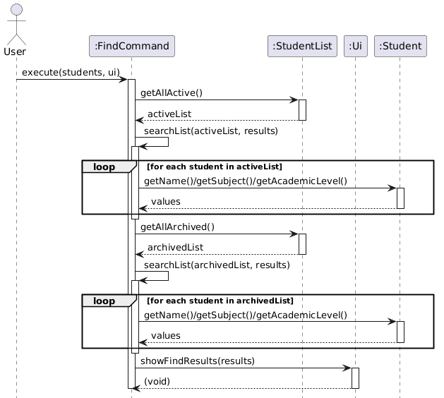

### Find feature

#### Current Implementation

The `find` feature is implemented using the Command design pattern and involves both the `Parser` and `FindCommand` classes.

When a user enters a `find` command:

1. `Parser.parseUserInput()` identifies the `find` keyword and delegates parsing to `parseFind(args)`.
2. `parseFind(args)` extracts values associated with the prefixes:
  - `n/` for name
  - `s/` for subject
  - `l/` for academic level
3. If the input is empty or no valid prefixes are detected, a `TutorSwiftException` is thrown to prevent invalid queries.
4. A `FindCommand` object is created with the extracted values. Fields not provided are set to `null`.
5. The command is returned and executed via `FindCommand.execute()`.

During execution:

1. The command retrieves both active and archived student lists from `StudentList`.
2. Each list is processed using the helper method `searchList(...)`.
3. For each student, matching is performed based on the non-null fields:
  - Matching uses `String.contains()` for partial matching
  - All comparisons are case-insensitive
4. Students that satisfy all specified conditions are added to a result list.
5. The results are passed to `Ui.showFindResults(...)` for display.

---

#### Design Considerations

**Flexible search fields**

- Alternative: Require all fields to be provided
- Chosen: Allow any combination of fields
- Rationale: Users may only know partial information, so flexibility improves usability

**Matching strategy**

- Alternative: Exact string matching
- Chosen: Partial and case-insensitive matching
- Rationale: Reduces user input errors and supports more natural queries

**Search scope**

- Alternative: Search only active students
- Chosen: Search both active and archived students
- Rationale: Ensures that archived records remain accessible

**Validation strategy**

- Alternative: Allow empty or invalid inputs and return no results
- Chosen: Throw `TutorSwiftException` for invalid inputs
- Rationale: Prevents meaningless operations and enforces correct usage

---

#### Notes

Sequence diagrams are used to illustrate:
- The interaction between `Parser` and `FindCommand`
- The execution flow of `FindCommand`

These diagrams provide a visual representation of the control flow and object interactions.