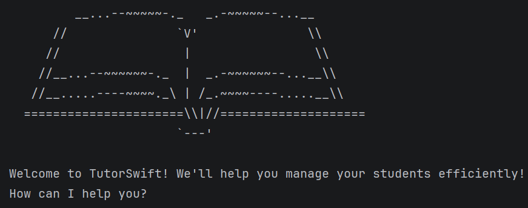

# User Guide

- Introduction
- Quick Start
- Features
- FAQ
- Command Summary

## Introduction

TutorSwift is a command-line application for private tutors to manage student records efficiently.
It allows users to add, edit, and track students, including their lessons, grades, fees, and payment status.

If you can type fast, TutorSwift helps you manage your students faster than traditional GUI apps.

## Quick Start

1. Ensure you have Java 17 or above installed.
2. Down the latest version of `TutorSwift` from [here](http://link.to/duke).
3. Copy the `.jar` file into an empty folder where you want to use as the home folder and store your TutorSwift data.
4. Open a command terminal, `cd` into the folder containing the TutorSwift jar file.
5. Run the command:
   `java -jar TutorSwift.jar`

    A CLI similar to the one below should appear in a few seconds.

   
    
6. Type commands in the command line and press Enter.

Some example commands:
- `add n/John Doe l/Secondary 2 sub/Math` : Adds a Secondary 2 student named John Doe taking Math to the student list.
- `list`: List all students.
- `delete 1` : Deletes the 1st student shown in the current list.
- `bye` : Exits the app.

Refer to the Features below for details of each command.

---

## Features 

### Notes about command format

- Words in UPPER_CASE are parameters to be supplied by the user.

  e.g. in `add n/NAME`, `NAME` is a parameter which can be used as `add n/John Doe`.

- Items in square brackets are optional.

  e.g. `n/NAME [l/ACADEMIC_LEVEL]` can be used as `n/John Doe l/Primary 6` or as `n/John Doe`.

- Parameters can be in any order.

  e.g. if the command specifies `n/NAME l/ACADEMIC_LEVEL`, `l/ACADEMIC_LEVEL n/NAME` is also acceptable.

- `INDEX` refers to the student number shown in the list.

- All `INDEX` values must be positive integers (1, 2, 3, ...).

- Extraneous parameters for commands that do not take in parameters (such as `list`, `upcoming`,  `bye`) will be ignored.

  e.g. if the command specifies `bye 123`, it will be interpreted as `bye`.

### Editing a student: `edit`

Edits an existing student in the student list.

Format: `edit INDEX [n/NAME] [l/ACADEMIC_LEVEL] [sub/SUBJECT]`

- Edits the person at the specified `INDEX`. The index refers to the index number shown in the displayed student list. The index must be a positive integer 1, 2, 3, …

- At least one of the optional fields must be provided.
  
- Existing values will be updated to the input values.

Examples of usage:

- `edit 1 n/Jane Doe l/Secondary 2 sub/Science` Edits the name, academic level and subject of the 1st student to be `Jane Doe`, `Secondary 2` and `Science` respectively.
- `edit 2 n/Ben Tan` Edits the name of the 2nd student to be `Ben Tan` and leaves the existing `ACADEMIC_LEVEL` and `SUBJECT` untouched.

### Deleting a student: `delete`

Permanently removes a student from the active list.

Format: `delete INDEX`

- Deletes the student at the specified `INDEX`.

- The `INDEX` refers to the index number shown in the active student list (use `list` to view it).

- The `INDEX` must be a positive integer 1, 2, 3, …

Example of usage:

- `list` followed by `delete 2` — Deletes the 2nd student in the active list.

Expected behaviour:
- Removes the student from the active list
- Displays the removed student's details and updated total count of remaining students in the list

### Adding a grade: `grade`

Adds a grade record to a student.

Format: `grade INDEX m/ASSESSMENT g/SCORE`

* The `INDEX` must be valid.
* The `SCORE` must be a number.

Example of usage:
`grade 1 m/Midterm g/85`

Expected behaviour:
- Adds a grade to the specified student
- Grade is stored as [ASSESSMENT:SCORE]
- Student details will display updated grades

### Adding a remark: `remark`

Adds a remark to a student.

Format: `remark INDEX r/REMARK`

* The `INDEX` must be a valid student number.
* The `r/` prefix is required.
* The `REMARK` cannot be empty.

Example of usage:
`remark 1 r/Very hardworking student`

Expected behaviour:
- Adds or updates the remark for the student
- Displays updated student details

### Scheduling a lesson: `schedule`

Schedules a new recurring weekly lesson for an existing active student in the student list.

Format: `schedule n/NAME day/DAY_OF_WEEK start/START_TIME end/END_TIME`

- Schedules a lesson for the student with the specified `NAME`. The name must exactly match an existing student in your active list (case-insensitive).

- The `DAY_OF_WEEK` must be a valid day (e.g., Monday, Tuesday, etc.).

- The `START_TIME` and `END_TIME` must be formatted in 24-hour time (HH:mm).

- `START_TIME` must be strictly before the `END_TIME`.

- Note on time conflicts: You cannot schedule a lesson that overlaps with another existing lesson for the same student. However, the system allows overlapping lessons across different students (useful for scheduling group tuition classes).

Examples of usage:

- `schedule n/Alice day/Monday start/10:00 end/12:00` Schedules a 2-hour lesson for Alice every Monday from 10:00 AM to 12:00 PM.
- `schedule n/John Doe day/Wednesday start/15:30 end/17:30` Schedules a lesson for John Doe every Wednesday from 3:30 PM to 5:30 PM.

### Viewing upcoming lessons: `upcoming`

Displays a sorted list of all scheduled lessons across all active students for the next 7 days, ordered by how soon they are happening relative to the current day and time.

Format: `upcoming`

- The list is sorted chronologically, starting with the lesson that is happening the earliest relative to the current day and time.

- Lessons that have already passed for the current day will be automatically pushed to next week's schedule.

- Lessons occurring today or tomorrow will be marked with helpful `(Today)` or `(Tomorrow)` tags next to the day.

- Archived students' lessons will not appear in this list.

Examples of usage:

- `upcoming` Displays the tutor's sorted lesson schedule for the upcoming week.

### Setting a lesson fee: `fee`

Sets the per-lesson fee for a student.

Format: `fee INDEX f/AMOUNT`

- `INDEX` refers to the student's position in the active list (use `list` to check).

- `AMOUNT` must be a positive integer representing the fee in dollars.

- The fee rate is stored and displayed alongside the student's record.

Example of usage:

- `fee 1 f/50` — Sets the per-lesson fee for student 1 to $50.

### Marking payment as paid: `paid`

Marks a student's payment as paid for a specified month.

Format: `paid INDEX ym/YYYY-MM`

- `INDEX` refers to the student's position in the active list (use `list` to check).

- The `ym/` prefix is required.

- `YYYY-MM` must be a valid year and month (e.g. `2026-04` for April 2026).

- Running `paid` for a month already marked paid has no effect — duplicate entries are not created.

- Multiple months can be tracked for the same student by running `paid` separately for each month.

Examples of usage:

- `paid 1 ym/2026-04` — Marks student 1 as paid for April 2026.

- `paid 1 ym/2026-05` — Marks student 1 as paid for May 2026 (previous paid months are preserved).

Expected behaviour:
- Adds the specified month to the student's paid records
- Displays updated student details including all paid months

### Marking payment as unpaid: `unpaid`

Marks a student's payment as unpaid for a specified month.

Format: `unpaid INDEX ym/YYYY-MM`

- `INDEX` refers to the student's position in the active list (use `list` to check).

- The `ym/` prefix is required.

- `YYYY-MM` must be a valid year and month (e.g., `2026-04` for April 2026).

- If the specified month was not previously marked as paid, a success message is shown
  but no data changes. Other months that are marked paid are unaffected.

Example of usage:
- `unpaid 1 ym/2026-04` — Removes the paid status for student 1 for April 2026.

Expected behaviour:
- Removes the specified month from the student's paid records
- Displays updated student details

### Exiting the application: `bye`

Exits the application.

Format: `bye`

- This command closes TutorSwift safely.

- Any existing data will be saved before exiting.

Examples of usage:

- `bye`

Expected behaviour:
- The application terminates

## FAQ

**Q**: Why does an unpaid month not appear in the student list after running `list`?

**A**: This is expected behaviour. Only months that are marked as paid are displayed in the student list. 
Unpaid months are intentionally not shown to keep the display clean and uncluttered.

**Q**: How do I transfer my data to another computer? 

**A**: {your answer here}

## Command Summary

{Give a 'cheat sheet' of commands here}

| Action         | Format                                                          | Examples                                            |
|----------------|-----------------------------------------------------------------|-----------------------------------------------------|
| Edit           | `edit INDEX [n/NAME] [l/ACADEMIC_LEVEL] [sub/SUBJECT]`          | `edit 1 n/Jane Doe l/Secondary 2 sub/Science`       |
| Delete         | `delete INDEX`                                                  | `delete 1`                                          |
| Add Grade      | `grade INDEX m/ASSESSMENT g/SCORE`                              | `grade 1 m/Midterm g/85`                            |
| Add Remark     | `remark INDEX r/REMARK`                                         | `remark 1 r/Very hardworking student`               |
| Schedule       | `schedule n/NAME day/DAY_OF_WEEK start/START_TIME end/END_TIME` | `schedule n/Alice day/Monday start/10:00 end/12:00` |
| Upcoming       | `upcoming`                                                      | -                                                   |
| Set Fee        | `fee INDEX f/AMOUNT`                                            | `fee 1 f/50`                                        |
| Mark as Paid   | `paid INDEX ym/YYYY-MM`                                         | `paid 1 ym/2026-04`                                 |
| Mark as Unpaid | `unpaid INDEX ym/YYYY-MM`                                       | `unpaid 1 ym/2026-04`                               |
| Exit           | `bye`                                                           | -                                                   |

